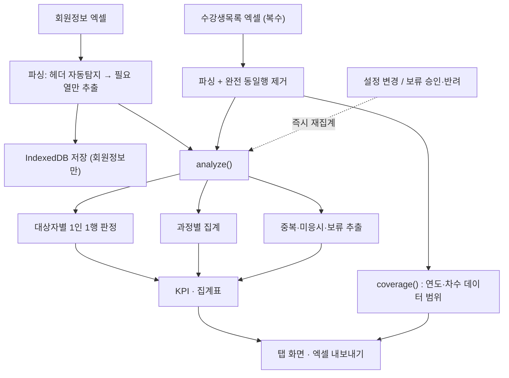

# 배움터 직무교육 통계 대시보드 — 기능사양서 (ver8)

| 항목 | 내용 |
|---|---|
| 시스템명 | 배움터 LMS 직무교육 통계 대시보드 |
| 버전 | **ver8** |
| 산출물 | `lms-statistics-v8.html` (단일 파일, 1.21MB) |
| 대상 업무 | 노인맞춤돌봄서비스 종사자 직무교육 이수 현황 집계 |
| 실행 방식 | 브라우저 단독 실행(설치·서버·인터넷 불필요) |
| 소스 | `lms-src/` (compute.js · app.js · app.css · page.html) |
| 문서 목적 | 기능 정의, 계산 규칙 명세, 인수인계·검증 근거 |

> 이 문서는 **무엇을 계산하는가(업무 규칙)** 와 **어떻게 계산하는가(구현 규칙)** 를 함께 기술합니다.
> 업무 담당자는 1·4·5·6·8·9·14장을, 유지보수 담당자는 전체를 참고하십시오.

---

## 1. 개요

### 1.1 배경 및 목적

배움터 LMS의 관리자 통계 기능만으로는 직무교육 이수 현황을 원하는 형태로 확인하기 어렵습니다.
이 도구는 배움터에서 내려받은 **원데이터 엑셀 2종(회원정보·온라인통합수강생목록)** 을 올리면,
직무교육 계획서상의 이수 기준을 적용해 이수율·미이수자·미응시자 등을 자동 집계합니다.

핵심 설계 원칙은 다음 세 가지입니다.

1. **로컬 단독 처리** — 개인정보(성명·ID·기관)를 다루므로 네트워크 전송을 일절 하지 않습니다.
2. **단일 파일 배포** — 설치·권한 요청 없이 파일 하나를 더블클릭해 사용합니다.
3. **규칙의 명시성** — 이수 판정 기준을 화면(설정 탭)에서 확인·변경할 수 있고, 변경 시 즉시 재집계합니다.

### 1.2 적용 범위

| 구분 | 포함 | 제외 |
|---|---|---|
| 대상 교육 | 직무교육(필수), 직무교육(선택) | 그 외 카테고리(집계 대상이나 이수 판정에는 미반영) |
| 대상 지역 | 16개 시도 | 중앙·미상 등 목록 외 지역(전 통계에서 제외) |
| 대상 직군 | 생활지원사, 전담사회복지사(광역 포함) | 중간관리자·기타수행기관종사자(이수기준 미정의로 별도 표기) |
| 기능 범위 | 집계·조회·엑셀 내보내기 | 데이터 수정·LMS 연동·이수증 발급 |

### 1.3 용어 정의

| 용어 | 정의 |
|---|---|
| **대상자(모수)** | 회원정보에서 `교육대상여부=Y` · `상태=정상` · 시도가 16개 이내이며, 이수기준이 정의된 직군(생활지원사·전담사회복지사)이고 교육구분이 신규자/경력자인 사람 |
| **이수** | 직군·경력 구분에 따른 필수/선택 요건을 모두 충족한 상태(§5.4) |
| **차수** | 원데이터 `연도/차수` 열의 차수 값(예: `2026 / 14` → 14차) |
| **이수일자** | 그 사람이 **필수과정을 수료 확정한 날짜**(§5.6). 경력자의 최종 이수 확정일과 다를 수 있음 |
| **재응시 과정** | 과정명이 `_재응시`로 끝나는, 최종평가 미응시·과락자용 별도 개설 과정 |
| **원과정** | `_재응시`·`_열람전용` 접미사가 없는 본 과정 |
| **보류(직군변경)** | 현재 직군의 필수과정은 미수료이나 다른 직군 필수과정을 수료해, 전직 가능성이 있어 담당자 판단이 필요한 건 |

---

## 2. 시스템 구성

### 2.1 처리 흐름

### 2.2 파일 구성

| 파일 | 역할 | 비고 |
|---|---|---|
| `compute.js` | **계산 엔진**(순수 함수). `analyze()`·`coverage()` | 브라우저·Node 공용, UI 의존 없음 |
| `app.js` | 화면 로직. 업로드·탭·표·필터·내보내기·설정 | |
| `app.css` | 스타일 | |
| `page.html` | HTML 골격(빌드 시 마커 치환) | |
| `vendor/xlsx.full.min.js` | SheetJS(엑셀 파싱) | base64로 내장 |
| `build.js` | 위 파일을 합쳐 `lms-statistics-v8.html` 생성 | `VERSION` 상수로 버전 표기 |
| `e2e.js` `edge.js` `pending_e2e.js` `persist.js` `unit_pending.js` | 검증 스크립트 | §13 |

빌드는 `cd lms-src && node build.js` 한 줄이며, SheetJS를 base64로 인코딩해 HTML에 내장하므로
결과 파일은 **외부 요청 없이(blob: URL) 동작**합니다.

### 2.3 실행 환경

| 항목 | 사양 |
|---|---|
| 브라우저 | Chrome / Edge 권장 (IndexedDB · File API · Blob URL 사용) |
| 실행 방법 | ① 파일 더블클릭(`file://`) ② GitHub Pages 등 웹 서버 배포 |
| 네트워크 | 불필요(전 기능 오프라인 동작) |
| 입력 형식 | `.xls`, `.xlsx`, `.csv` |

---

## 3. 입력 데이터 사양

### 3.1 회원정보 (①)

읽어들이는 열은 다음과 같으며, **이 중 판정에 직접 쓰이는 열은 굵게** 표시했습니다.

`No`, **`시도`**, `시군구`, `읍면동`, `기관코드`, `기관명`, `성명`, **`ID`**, **`사용자유형`**,
`권한관리자`, `일반`, `중점`, `특화`, `퇴원`, `고도화`, `선임여부`, **`교육대상여부`**, **`교육구분`**, **`상태`**

| 열 | 용도 | 기대값 |
|---|---|---|
| `ID` | 개인 식별 키(본인인증 기반 고유값) | — |
| `사용자유형` | 직군 판정 | 생활지원사 / 전담사회복지사 / 광역전담사회복지사 / 기타 |
| `교육구분` | 경력 구분 | 신규자 / 경력자 |
| `교육대상여부` | 모수 필터 | `Y` |
| `상태` | 모수 필터 | `정상` |
| `시도` | 지역 필터 + 모든 수강기록의 지역 판정 기준 | 16개 시도 |

`교육대상여부`·`교육구분` 열이 모두 없으면 **"회원정보 파일이 아닌 것 같습니다"** 경고를 표시합니다.

### 3.2 수강생목록 (②) — 온라인통합수강생목록

`카테고리`, `과정명`, `교육차시`, `교육신청일`, `진도율`, `점수`, `수료여부`, `수료일`, `상태`,
`ID`, `성명`, `기관코드`, `기관명`, `시도`, `시군구`, `사용자유형`, `자격번호`, `연도/차수`

| 열 | 용도 | 기대값 |
|---|---|---|
| `카테고리` | 필수/선택 구분 | `직무교육(필수)` / `직무교육(선택)` |
| `과정명` | 경력·직군·과목·재응시 여부 추출 | 예: `[2026년 경력자 필수] 생활지원사`, `[2026년 선택] 치매예방_재응시` |
| `수료여부` | 수료 인정 | `수료` |
| `상태` | 제외 필터 | `수강취소`는 전량 제외 |
| `진도율`·`점수` | 미응시 판정 | 숫자(문자열 허용) |
| `연도/차수` | 차수 추출 | `2026 / 14` 형식 |
| `사용자유형` | **수료 당시** 직군(보류 판정용) | 회원정보의 현재 직군과 비교 |

`과정명` 열이 없으면 **"수강생목록이 아닌 것 같습니다"** 경고를 표시합니다.

### 3.3 파일 파싱 규칙

| 규칙 | 내용 |
|---|---|
| 헤더행 자동 탐지 | 상위 12행 중 `ID` 셀이 있는 **첫 행**을 헤더로 사용. 못 찾으면 1행. (제목·빈 줄이 위에 있어도 인식) |
| 열 선별 | 위 목록에 있는 열만 객체로 보관(메모리 절약) |
| 빈 행 | 모든 값이 비어 있는 행은 제외 |
| 값 처리 | 원시 문자열 유지(`raw:false`). 숫자 비교 시에만 숫자 변환 |
| 복수 파일 | 회원정보·수강생목록 모두 여러 개 동시 선택 가능. 수강생목록은 **누적(append)** |

### 3.4 전처리

| 처리 | 대상 | 규칙 |
|---|---|---|
| **완전 동일행 제거** | 수강생목록 | 위 18개 열 값이 **모두** 같은 행은 1건만 남김. 같은 파일 중복 업로드·원본 중복행 대응. 제거 건수는 상태바·데이터 현황에 표시 |
| 수강취소 제외 | 수강생목록 | `상태 = 수강취소` 행 제외(`수강취소제외` 지표로 집계) |
| 지역 필터 | 수강생목록 | 해당 `ID`의 **회원정보상 시도**가 16개 밖이면 제외 |

> ⚠️ 지역 필터는 수강기록의 `시도` 열이 아니라 **회원정보의 시도**를 기준으로 합니다.
> 따라서 **회원정보에 없는 ID의 수강기록은 전량 제외**됩니다(시도를 확인할 수 없으므로).
> 과목별 현황·중복자 확인을 포함한 모든 통계가 이 필터 이후의 데이터로 산출됩니다.

---

## 4. 집계 대상(모수) 결정

회원정보 각 행에 대해 다음 순서로 판정합니다.

| 순서 | 조건 | 불충족 시 |
|---|---|---|
| 1 | `교육대상여부 = Y` **AND** `상태 = 정상` | 집계 제외(카운트 없음) |
| 2 | `시도` ∈ 16개 시도 | 제외 + **`지역외제외`** 지표에 계상 |
| 3 | 직군정규화 ∈ {생활지원사, 전담사회복지사} **AND** `교육구분` ∈ {신규자, 경력자} | 대상자 명단에는 남되 **`기준미정의대상`** 으로 분류, 헤드라인 이수율에서 제외 |

**대상자(모수) = 1·2·3을 모두 통과한 인원**이며, 이수율·시도별·직군별 등 모든 헤드라인 통계의 분모입니다.

16개 시도: 서울, 경기, 인천, 부산, 대전, 대구, 울산, 광주, 강원, 경남, 경북, 전남, 전북, 충남, 충북, 제주
(설정 탭에서 변경 가능)

---

## 5. 이수 판정 규칙 ★

### 5.1 직군 정규화

| 회원정보 `사용자유형` | 정규화 결과 | 이수기준 |
|---|---|---|
| 생활지원사 | 생활지원사 | 정의됨 |
| 전담사회복지사 | 전담사회복지사 | 정의됨 |
| **광역**전담사회복지사 | 전담사회복지사 | 정의됨(전담과 동일 기준 적용) |
| 그 외(중간관리자 등) | 원값 유지 | **미정의** → 기준미정의대상 |

### 5.2 필수과정 수료 인정

수강기록이 다음을 **모두** 만족할 때 `(경력, 직군)` 조합의 필수 수료로 적립합니다.

1. `카테고리 = 직무교육(필수)`
2. `수료여부 = 수료`
3. 과정명에서 **경력**(`신규자`|`경력자`)과 **직군**(`생활지원사`|`전담사회복지사`)이 모두 추출됨
   — 과정명 내 문자열 포함 여부로 판정하므로 `_재응시` 접미사가 있어도 정상 인식됩니다.

그리고 판정 시에는 다음이 **일치해야만** 인정됩니다.

> **적립된 `(경력|직군)` 조합 == (회원정보 `교육구분` | 정규화 직군)**

| 사례 | 결과 |
|---|---|
| 경력자·생활지원사가 `[2026년 경력자 필수] 생활지원사` 수료 | ✅ 인정 |
| 경력자·생활지원사가 `[2026년 경력자 필수] 생활지원사_재응시` 수료 | ✅ 인정 |
| 경력자·생활지원사가 `[2026년 **신규자** 필수] 생활지원사` 수료 | ❌ 불인정(경력 불일치) |
| 전담사회복지사가 `[…] 생활지원사` 수료 | ❌ 불인정 → **보류 후보**(§5.5) |

### 5.3 선택과목 차시 합산

1. 선택 과정명을 **과목명으로 정규화**합니다: 앞의 `[…]` 토큰 제거 + `_재응시`·`_열람전용` 접미사 제거
   (예: `[2026년 선택] 치매예방_재응시` → `치매예방`)
2. 정규화 과목명 기준 **집합(Set)** 으로 수료 과목을 모읍니다 → **같은 과목을 여러 번 수료해도 1회만 계산**
3. 과목별 차시표(설정 탭, 기본 26과목)를 조회해 합산합니다
4. 차시표에 없는 과목은 **0차시**로 계산되며, 요약 화면에 "차시 매핑 없는 과목" 안내를 표시합니다

기본 차시표(직무교육 계획서 기준, 발췌):

| 과목 | 차시 | 과목 | 차시 |
|---|---|---|---|
| 노인 신체건강 | 3 | 노인 상담기법 이해와 활용(내러티브·동기강화) | 5 |
| 노인 정신건강 | 3 | 노인 상담기법 이해와 활용(인지치료·강점관점) | 4 |
| 노년기 영양관리 / 보건관리 | 2 | 고위험 노인 상담 및 사례관리 | 4 |
| 치매예방 | 2 | 종사자가 알아야 할 기초노무지식 | 4 |
| 종사자 인권과 안전관리 | 3 | 선임생활지원사 직무 및 역할 | 3 |
| (그 외 선택과목) | 2 | | |

### 5.4 이수 판정식

| 경력 구분 | 이수 조건 |
|---|---|
| **신규자** | 필수과정 수료 |
| **경력자** | 필수과정 수료 **AND** 선택과목 차시 합계 ≥ 기준차시 |

기준차시: **생활지원사 13차시 · 전담사회복지사 10차시** (설정 탭에서 변경 가능)

미이수 시 사유를 함께 기록합니다.

| 사유 표기 | 의미 |
|---|---|
| `필수 미수료` | 해당 (경력·직군) 필수과정 미수료 |
| `선택 N/M차시` | 필수는 수료했으나 선택 차시 부족 |
| `필수 미수료 + 선택 N/M차시` | 둘 다 미충족 |
| `직군변경 검토 필요(당시 ○○)` | 보류 후보, 미검토 상태 |
| `이수기준 미정의(○○)` | 기준미정의 직군 |

### 5.5 직군변경(전직) 보류 처리

**보류 후보 조건**: 이수기준이 정의된 대상자이면서, ① 현재 직군의 필수과정은 미수료이고
② **다른 직군**의 필수과정을 수료한 이력이 있는 경우.
(수료 당시 `사용자유형`이 그 과정의 직군과 일치하는 기록을 우선 채택합니다.)

| 상태 | 이수 판정 | 명단 노출 |
|---|---|---|
| **미검토(pending)** — 기본값 | 미이수 | 이수자·미이수자 명단에서 **제외**(보류 탭에서만 처리) |
| **승인(approve)** | 당시 직군 수료를 인정 → 필수 수료 처리(경력자는 선택 차시도 별도 충족 필요) | 명단 포함 |
| **반려(reject)** | 미이수 확정 | 명단 포함 |

- 승인/반려 결정은 **브라우저에 영구 저장**되며, 변경 즉시 전체 통계가 재계산됩니다.
- 보류 탭은 "승인 시" 열에 **승인하면 이수가 되는지(경력자 선택차시 충족 여부)** 를 미리 표시합니다.

### 5.6 차수 · 이수일자 산출

명단의 `차수`·`이수일자`는 **필수과정을 수료 확정한 차수·날짜**입니다.

| 규칙 | 내용 |
|---|---|
| 대상 기록 | 그 사람의 (경력 = 회원정보 교육구분, 직군 = 정규화 직군)에 일치하는 필수 수료 기록 |
| 선택 기준 | **가장 높은 차수**, 동일 차수면 **가장 늦은 수료일** |
| 보류 승인건 | 당시 직군 수료 기록(crossDone)의 차수·수료일 사용 |
| 값이 없는 경우 | 표에는 `-`, 엑셀에는 공백. 명단 정렬에서 맨 뒤 |

> ⚠️ **경력자는 필수를 먼저 끝낸 뒤 선택과목을 나중에 채워 이수가 확정될 수 있어**, 이 날짜가
> 실제 최종 이수 확정일과 다를 수 있습니다(선택과목은 개별 수료일이 원데이터에 기록되지 않아
> 계산에 포함할 수 없음). 같은 필수과정을 여러 차수에 재수강한 경우 **나중 차수**가 표기됩니다(§14).

---

## 6. 파생 지표(KPI) 정의

| 지표 | 정의 |
|---|---|
| `대상자` | §4를 모두 통과한 인원 수(헤드라인 분모) |
| `이수자` / `미이수자` | 대상자 중 §5.4 충족 / 미충족 인원 |
| `이수율` | 이수자 ÷ 대상자 × 100 |
| `기준미정의대상` | 모수 1·2는 통과했으나 이수기준이 정의되지 않은 직군 인원 |
| `지역외제외` | 교육대상이나 시도가 16개 밖이라 제외된 인원 |
| `대상자중수강기록없음` | 대상자이나 수강기록이 전혀 없는 인원(전원 미이수, 미수강 독려 대상) |
| `수강취소제외` | `상태=수강취소`로 제외된 수강 행 수 |
| `미응시연인원` | 진도율 100·점수 0 조건에 해당하는 (인원 × 과목) 건수 |
| `재응시필요인원` | 위 중 해당 과목 미완료이면서 본인이 직무교육 미이수인 건수 |
| `보류미검토` / `보류승인` | 직군변경 보류 건의 검토 상태별 인원 |
| `중복수료건수` / `중복수료인원` | 같은 ID가 같은 과정을 2회 이상 수료한 건수 / 해당 인원(ID) 수 |
| `중복수료필수` / `중복수료선택` | 위 건수의 카테고리별 분해 |
| `중복동일차수` | 중복 건 중 **같은 차수 안에서** 중복된 건수(데이터 이상 의심 대상) |

**미응시 판정**: `진도율 ≥ 100` **AND** `점수 ≤ 0` **AND** 미수료 (임계값은 설정 탭에서 변경 가능)
**재응시 필요**: 위 조건 + 해당 과목 최종 미완료 + 본인이 직무교육 미이수
→ 이미 이수한 사람은 재응시 안내 대상에서 자동 제외됩니다.

---

## 7. 과정 분류 체계 (ver8 신설)

모든 과정을 **유형**과 **구분** 두 축으로 분류합니다.

| 축 | 값 | 판정 근거 |
|---|---|---|
| **유형** | `필수·신규` / `필수·경력` / `선택` / `기타` | 카테고리 + 과정명의 신규자·경력자 토큰 |
| **구분** | `원과정` / `재응시` / `열람전용` | 과정명 접미사 `_재응시`, `_열람전용` |
| **원과정** | 재응시·열람전용인 경우 접미사를 제거한 본 과정명 | — |

**도입 배경**: 재응시 과정은 원과정과 별개 과정으로 개설되어 있어, 과정 단위로 인원을 합산하면
동일인이 원과정과 재응시 과정 양쪽에 계상됩니다(검증 데이터 기준 재응시 신청자의 약 72%가
원과정에도 신청). 과목별 현황에서 **구분 = 원과정** 으로 필터하면 인원 중복 없는 통계가 됩니다.

**이수 판정에는 영향이 없습니다.** 재응시 과정의 수료도 §5.2·§5.3에 따라 정상적으로 이수 크레딧으로
인정되며, 사람 단위로 1회만 집계되므로 이수율에는 원래부터 중복이 발생하지 않습니다.

---

## 8. 화면 기능 명세

### 8.0 공통

| 요소 | 사양 |
|---|---|
| 업로드 | ① 회원정보 ② 수강생목록 두 영역. 파일 선택 또는 **드래그&드롭**. 진행률 오버레이 표시 |
| 상태바 | 회원정보 인원·적재시각, 수강 행수·파일수, 데이터 연도·최신차수, 중복 제거 건수, 전체 이수율 |
| 표 공통 | 컬럼 헤더 클릭 정렬(한국어 로케일), 페이지네이션(30~50행), 총 건수 표시 |
| 필터 공통 | 드롭다운(전체 포함) + 텍스트 검색. **필터 결과가 그대로 엑셀로 내보내집니다** |
| 재집계 | 설정 변경·보류 결정 시 즉시 전체 재계산 |

### 8.1 탭별 기능

| # | 탭 | 주요 기능 |
|---|---|---|
| 1 | **요약** | KPI 5종(대상자·이수자·미이수자·이수율·재응시 필요), 집계 기준 안내, 예외 인원 안내(지역외 제외·보류 미검토·수강기록 없음·차시 미매핑), **이수율 현황표**(§8.2), 직군·경력별 이수 현황표 |
| 2 | **데이터 현황** | 업로드 데이터의 연도·최신차수·총 건수·신청일/수료일 범위, 업로드 파일 목록, **연도·차수별 수강 건수**, **과정별 최신 차수 및 보유 차수**(`1~6, 9, 11~13` 형태로 압축 표기) |
| 3 | **이수율 현황** | **시도 → 시군구 → 기관** 3단계 펼침 트리(대상자·이수자·미이수·이수율 막대), 직군·경력별 이수율 |
| 4 | **이수자·미이수자 명단** | 이수여부/시도/직군/경력 필터 + 검색. 기본값 **미이수자만**. 연번은 **차수 → 이수일자 → 성명** 순 고정 부여. 필터에 따라 파일명이 자동으로 바뀜(§9) |
| 5 | **미응시·재응시** | 진도율 100·점수 0 건. **차수 필터**, 직무교육 이수여부 필터(이수자 자동 제외), 재응시 필요만 보기, 시도 필터 |
| 6 | **보류·직군변경** | 건별 **미검토/승인/반려** 버튼(즉시 반영), 당시 직군·수료한 필수과정·선택차시·"승인 시" 결과 표시, 검토상태·시도 필터 |
| 7 | **중복자 확인** | 같은 ID가 같은 과정을 2회 이상 수료한 건. **중복유형**(재수강(다차수) / 동일차수 중복) 구분·필터, 요약 칩 4종, 수료 차수·수료일 나열 |
| 8 | **과목별 현황** | 과정별 신청자·수료자·수료율. **유형·구분 필터**와 과정 검색, 재응시 행에 원과정명 표시 |
| 9 | **개인 조회** | ID 또는 성명 검색(동명이인은 목록에서 선택) → 이수 여부·필수·선택 차시·미이수 사유·전체 수강 이력. **진단 데이터(JSON) 내보내기** 및 **개인정보 가림 버전** 제공 |
| 10 | **설정·도움말** | 이수 기준·차시표·대상 시도·미응시 임계값 편집, 기본값 초기화, 사용 안내, 데이터 관리(회원정보 삭제 / 수강데이터 비우기 / 검토결정 초기화) |

### 8.2 이수율 현황표 (요약 탭)

보고용 표로, 직군별 이수인원을 배정·채용 인원과 대비합니다.

| 열 | 산출 |
|---|---|
| 이수인원(A) — 신규자 / 경력자 / 소계 | 산출기간 내 이수자 수 |
| 교육대상 | 해당 직군 대상자 수(**전체 기준**) |
| 배정인원(B) / 채용인원(C) | **사용자 직접 입력**(브라우저에 저장) |
| 대상대비 / A/B / A/C | 소계 ÷ 각 분모 × 100 |

행은 전담사회복지사 · 생활지원사 · 총계로 구성됩니다.

**산출기간**(ver7 도입)은 **이수인원(A)에만** 적용되며 교육대상·배정·채용은 전체 기준입니다.

| 모드 | 동작 |
|---|---|
| 전체 | 기간 제한 없음 |
| 차수 기준 | 시작~끝 차수 범위 내 이수자만 집계. 차수가 없는 사람은 제외 |
| 이수일자 기준 | 시작~끝 날짜 범위 내 이수자만 집계. 이수일자가 없는 사람은 제외 |

선택한 산출기간과 "배정·채용 기준일 메모"는 화면 상단과 **엑셀 파일 머리말에 함께 기록**됩니다.

---

## 9. 출력물(엑셀·JSON) 사양

모든 표는 화면에 적용된 **필터·검색 결과 그대로** 내보냅니다.

| # | 파일명 | 출처 탭 | 주요 열 |
|---|---|---|---|
| 1 | `이수율_현황표.xlsx` | 요약 | 머리말(산출기간·기준 메모) + 직군, 신규자, 경력자, 이수인원(A), 교육대상, 배정인원(B), 채용인원(C), 대상대비, A/B, A/C |
| 2 | `시도별_이수현황.xlsx` | 이수율 현황 | 시도, 대상자, 이수자, 미이수자, 이수율(%) |
| 3 | `이수자명단.xlsx` / `미이수자명단.xlsx` / `이수_미이수자명단.xlsx` | 명단 | **연번, 시도, 시군구, 기관코드, 수행기관, ID, 성명, 직급, 경력, 차수, 이수일자, 이수여부** (필터에 따라 파일명 자동 변경) |
| 4 | `미응시_재응시대상.xlsx` | 미응시·재응시 | ID, 성명, 시도, 시군구, 수행기관명, 기관코드, 직급, 차수, 구분, 미응시 과목/과정, 진도율, 점수, 해당과목 완료, 직무교육 이수, 재응시 필요 |
| 5 | `직군변경_보류검토.xlsx` | 보류·직군변경 | ID, 성명, 지역, 기관, 현재 직급, 경력, 당시 직군, 수료한 필수과정, 선택차시, 승인 시, 검토 |
| 6 | `중복이수_확인.xlsx` | 중복자 확인 | ID, 성명, 지역, 기관, 직급, 구분, 중복 수료 과정, **중복유형**, 수료횟수, 수료 차수, 수료일, 직무교육 이수 |
| 7 | `과목별_현황.xlsx` | 과목별 현황 | 과정명, **유형, 구분, 원과정**, 신청자, 수료자, 수료율 |
| 8 | `연도차수별_현황.xlsx` · `과정별_차수현황.xlsx` | 데이터 현황 | 연도, 차수, 건수, 신청일 범위 / 과정명, 카테고리, 최신차수, 보유차수, 건수, 최근 신청·수료일 |
| 9 | `{ID}_수강이력.xlsx` | 개인 조회 | 구분, 과정/과목, 차수, 진도율, 점수, 수료, 수료일, 상태 |
| 10 | `진단_{ID}.json` / `진단_masked.json` | 개인 조회 | 판정결과·회원정보·적용규칙·수강이력. 가림 버전은 **ID·성명·기관명·기관코드를 마스킹** |

---

## 10. 설정 항목

| 항목 | 기본값 | 영향 |
|---|---|---|
| 경력자 선택교육 기준차시 | 생활지원사 **13**, 전담사회복지사 **10** | 경력자 이수 판정 |
| 미응시 판정 임계값 | 진도율 ≥ **100**, 점수 ≤ **0** | 미응시·재응시 탭, 관련 KPI |
| 통계 대상 시도 | 16개 시도(쉼표 구분 편집) | 전 통계의 대상 범위 |
| 선택 과목별 차시 | 26개 과목(추가·수정 가능) | 경력자 선택 차시 합산 |
| 배정·채용 인원, 기준일 메모 | 미입력 | 이수율 현황표 A/B·A/C |
| 산출기간 | 전체 | 이수율 현황표의 이수인원(A) |

- 변경 즉시 재집계되며 **브라우저에 저장**되어 다음 실행 시 유지됩니다.
- "기본값으로 초기화" 버튼으로 전체 되돌리기가 가능합니다.

---

## 11. 데이터 저장 및 보안

| 항목 | 사양 |
|---|---|
| 처리 위치 | **전량 브라우저 로컬**. 네트워크 전송 없음(외부 스크립트·폰트·CDN 요청 없음) |
| 저장소 | IndexedDB `lms-stats` / 오브젝트스토어 `kv` |
| 저장 항목 | `members`(회원정보 원본 행), `memberMeta`(건수·파일명·적재시각), `config`(설정), `decisions`(보류 검토 결정) |
| **저장하지 않는 항목** | **수강생목록** — 매 실행 시 다시 업로드해야 합니다(용량·최신성 고려) |
| 삭제 수단 | 설정 탭: 저장된 회원정보 삭제 / 수강데이터 비우기 / 검토결정 초기화 |
| 산출물 관리 | 개인정보가 포함된 명단 엑셀은 저장소에 커밋 금지(`.gitignore`로 차단) |

---

## 12. 비기능 요구사항

| 항목 | 사양 |
|---|---|
| 처리 규모 | 수십만 행 처리 가능. 수강기록은 **단일 순회(1-pass)** 로 집계하며, ID·과정 집계에 Map/Set을 사용해 선형 시간으로 동작 |
| 응답성 | 파일 파싱·집계 중 진행률 오버레이 표시. 파일 단위로 이벤트 루프를 양보해 화면 멈춤 최소화 |
| 메모리 | 필요한 열(회원 19·수강 18)만 보관 |
| 배포 | 단일 HTML 1.21MB(SheetJS 내장). 설치·권한 불필요 |
| 국제화 | 한국어 전용. 숫자·정렬은 `ko-KR` 로케일 |

---

## 13. 검증

### 13.1 검증 스크립트

| 스크립트 | 검증 내용 |
|---|---|
| `unit_pending.js` | 합성 데이터로 직군변경 보류 로직(미검토/승인/반려) 단위 검증 |
| `e2e.js` | **실데이터 브라우저 검증** — KPI 일치, 시도 필터, 데이터 현황, 재응시·중복·과정 분류, 탭 렌더링, 명단 엑셀 재파싱(헤더 순서·연번 연속·정렬·값 채움) |
| `edge.js` | 업로드 순서 반대, 같은 파일 재업로드, 잘못된 파일 업로드, 전 탭 정렬·필터·설정 변경 |
| `pending_e2e.js` | 보류 승인/반려 UI 워크플로우와 통계 반영 |
| `persist.js` | 새로고침 후 회원정보 복원 및 다운로드 동작 |

### 13.2 검증 결과 (2026-06-26 기준 실데이터)

| 항목 | 값 |
|---|---|
| 회원정보 | 59,148명 |
| 데이터 범위 | 2026년 · 최신 **14차** · 교육신청일 ~2026-06-26 |
| 교육대상자 | **36,424명** |
| 이수자 / 이수율 | **16,374명 / 44.95%** |
| 기준미정의 대상 | 659명 |
| 지역외(중앙·미상) 제외 | 351명 |
| 과정 수 | 58개 (이 중 재응시 27개) |
| 중복 수료 | 271건 = 재수강(다차수) 250건 + **동일차수 중복 21건** |
| 산출기간 분할 검증 | 1~5차 16,117명 + 6~14차 257명 = 16,374명 (전체와 일치) |

전 스크립트 통과, 콘솔 오류 0건. 별도 무결성 감사 14항목(이수자⇒필수수료, 경력자 선택차시 충족,
차수↔이수일자 일관성, 집계표 합계 = KPI, 이수일자 형식 전수 등) 전체 통과.

---

## 14. 제약사항 및 유의사항

| # | 내용 |
|---|---|
| 1 | **수강생목록을 모두 올려야 정확합니다.** 일부만 올리면 그만큼 미이수자가 많게 나옵니다. |
| 2 | **수강데이터는 저장되지 않습니다.** 브라우저를 닫으면 다시 업로드해야 합니다(회원정보·설정·검토결정은 유지). |
| 3 | **회원정보에 없는 ID의 수강기록은 전량 제외**됩니다(§3.4). 회원정보를 최신본으로 유지하십시오. |
| 4 | **경력자의 이수일자는 필수과정 수료일**이며 최종 이수 확정일과 다를 수 있습니다(선택과목 수료일이 원데이터에 없음). |
| 5 | 같은 필수과정을 여러 차수에 재수강한 경우 **나중 차수/수료일**이 이수일자로 표기됩니다. 차수 기준 산출기간을 좁게 지정하면 이런 인원이 범위 밖으로 빠질 수 있습니다. |
| 6 | **미응시·재응시 탭은 수강기록 기준**이라 교육대상 모수 밖 인원도 포함될 수 있습니다(직급·경력 열이 비어 있으면 모수 밖 인원). |
| 7 | `_열람전용` 과정은 원과목과 같은 과목으로 정규화되므로, 수료로 기록되면 선택 차시가 인정됩니다. |
| 8 | 차시표에 없는 선택과목은 **0차시**로 계산됩니다. 요약 탭 안내를 확인해 설정에서 추가하십시오. |
| 9 | 이수 판정은 원데이터의 `수료여부=수료`를 그대로 신뢰합니다. LMS 원본이 잘못된 경우는 이 도구에서 보정하지 않습니다. |
| 10 | 중복자 확인의 **재수강(다차수)** 은 과락자 재수강이라는 정상 흐름일 수 있습니다. 실제 점검 대상은 **동일차수 중복**입니다. |

---

## 15. 변경 이력

| 버전 | 주요 변경 |
|---|---|
| **ver8** | **재응시 과정 분리** — 과목별 현황에 유형(필수·신규/필수·경력/선택)·구분(원과정/재응시/열람전용) 분류·필터 및 원과정명 표기 신설, 엑셀 내보내기를 필터 결과 기준으로 통일. 중복자 확인에 **중복유형**(재수강(다차수)/동일차수 중복) 구분·필터·요약 추가. 이수 판정 무변경 |
| ver7 | 이수율 현황표에 **산출기간**(전체/차수 범위/이수일자 범위) 도입. 엑셀에 산출기간 명시 |
| ver6 | 명단에 **이수일자** 추가, 연번·정렬 기준을 차수 → 이수일자로 변경 |
| ver5 | 명단 다운로드 컬럼 순서 고정, **차수** 컬럼 추가 |
| ver3~4 | 이수율 현황표(배정·채용 대비, 직접 입력), 미응시·재응시 차수 필터 및 이수자 자동 제외, **중복자 확인** 탭, 데이터 현황(연도·차수), 직군변경 보류 검토 |

---

## 부록 A. 계산 결과 데이터 사전

`analyze()`가 반환하는 주요 구조입니다(유지보수용).

| 키 | 내용 |
|---|---|
| `kpi` | §6의 지표 일체 |
| `persons[]` | 대상자 1인 1행 판정 결과 — ID, 성명, 지역, 기관, 직군, 직군정규화, 경력, 필수수료, 선택차시, 필요차시, 이수, 차수, 이수일자, 기준정의, 사유, 보류후보, 보류상태, 당시직군, 승인시이수 등 |
| `notCompleted[]` | 대상자 중 미이수(보류 미검토 제외) |
| `pendingRows[]` | 직군변경 보류 후보 |
| `byGroup[]` / `bySido[]` | (직군/경력)별 · 시도별 대상자·이수자·미이수자·이수율 |
| `sidoTree` | 시도 → 시군구 → 기관 3단계 집계(Map) |
| `courseRows[]` | 과정명, 카테고리, **유형, 구분, 원과정**, 신청자, 수료자, 수료율 |
| `examNoShowRows[]` | 미응시 건(1인 1과목) + 해당과목완료·전체이수·재응시필요 |
| `duplicateRows[]` | 중복 수료 건 + **중복유형**·수료횟수·차수·수료일 |
| `unknownChasi` | 차시 매핑이 없는 선택과목별 건수 |

`coverage()` 반환: `byYearRound[]`(연도·차수별 건수와 신청일 범위), `byCourse[]`(과정별 최신·보유 차수),
`summary`(연도, 최신차수, 행수, 최초·최근 신청일, 최근 수료일).

---

*본 문서는 `lms-statistics-v8.html` 및 `lms-src/` 소스 기준으로 작성되었습니다.
사용 안내는 [`lms-statistics-v8.README.md`](./lms-statistics-v8.README.md), 빌드 방법은 [`lms-src/README.md`](./lms-src/README.md)를 참고하십시오.*
